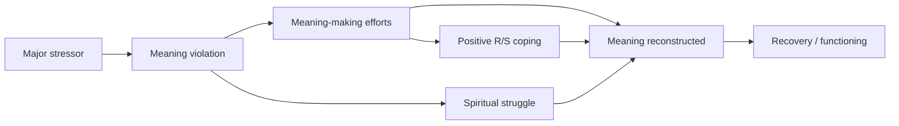
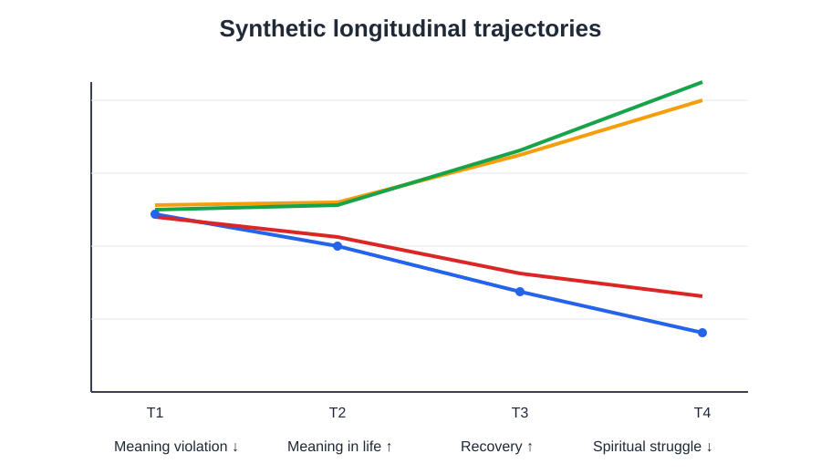
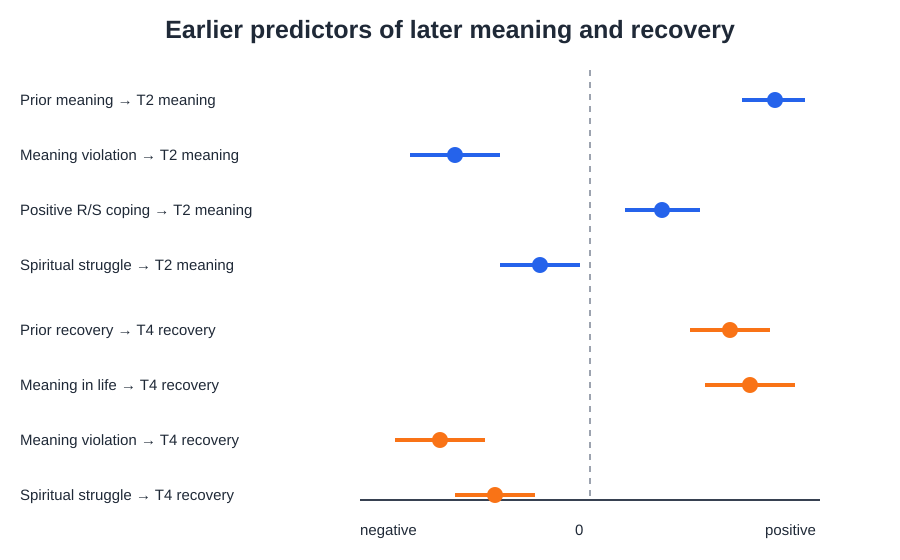
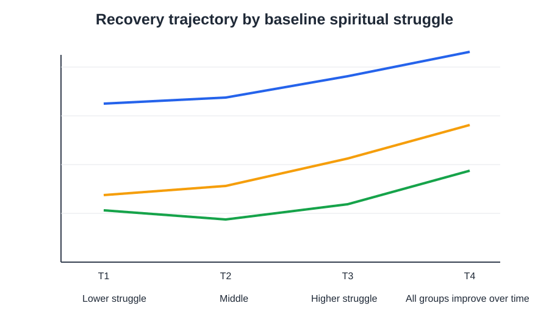

# Meaning Pathways

**A reproducible longitudinal research prototype for studying meaning violation, religious/spiritual coping, and psychological recovery after major stress.**

  

## Research question

> After a major stressor disrupts a person's beliefs and goals, how do meaning-making efforts, positive religious/spiritual coping, and spiritual struggle shape the reconstruction of meaning and psychological recovery over time?

This repository operationalizes that question as a **four-wave prospective longitudinal design**. The analysis is organized as a layered longitudinal modeling workflow, with each model tied to a specific theoretical question rather than statistical complexity for its own sake.

**All participants, item responses, interview excerpts, and results in this repository are synthetic. No real participant or personal testimony is included.**

## Conceptual model



The conceptual foundation distinguishes **global/situational meaning, meaning-making efforts, and meaning made**, following the meaning-making literature. Religion/spirituality is modeled as potentially helpful **or** difficult: positive R/S coping and spiritual struggle are separate constructs rather than opposite ends of one scale.

## Why this project is methodologically different from a simple regression demo

The analysis pipeline contains four linked layers:

1. **Longitudinal CFA + measurement invariance**  
   Tests whether core constructs have comparable measurement structure over time before interpreting change.
2. **Latent Growth Curve Model (LGCM)**  
   Estimates individual differences in initial recovery and recovery slope.
3. **Random-Intercept Cross-Lagged Panel Model (RI-CLPM)**  
   Separates stable between-person differences from within-person temporal dynamics between meaning violation and meaning in life.
4. **Longitudinal mediation + moderated mediation**  
   Tests whether meaning-making processes statistically carry the association from early disruption to later recovery, and whether spiritual struggle conditions that pathway.

The repository also includes a small synthetic qualitative component to preserve the distinction between a numeric trajectory and the participant-level meaning of that trajectory.

## Study design

- **N = 320** synthetic adults exposed to a major stressor
- **T1:** 1–3 months after the stressor
- **T2:** approximately 6 weeks after baseline
- **T3:** approximately 3 months after baseline
- **T4:** approximately 6 months after baseline
- Monotone synthetic attrition is included so the SEM scripts use **FIML** rather than complete-case deletion

### Core constructs

| Construct | Role in model |
|---|---|
| Meaning violation | Belief and goal discrepancy following stress |
| Meaning in life | Coherence, purpose, future direction |
| Positive R/S coping | Meaning-making effort using religious/spiritual resources |
| R/S struggle | Abandonment, anger, doubt, guilt, or spiritual conflict |
| Recovery/functioning | Hope, functioning, emotional steadiness, future orientation |

The demo items are original synthetic placeholders. They are **not validated instruments and should not be used for clinical or field research**.

## Repository map

```text
meaning-pathways/
├── R/
│   ├── 01_data_validation.R
│   ├── 02_cfa_invariance.R
│   ├── 03_latent_growth.R
│   ├── 04_ri_clpm.R
│   ├── 05_longitudinal_mediation.R
│   ├── 06_moderated_mediation.R
│   ├── 07_visualization.R
│   └── 08_qualitative_summary.R
├── data/demo/              # generated synthetic data + interview excerpts
├── instruments/
├── results/
├── figures/
├── docs/
├── tests/
├── scripts/generate_synthetic_data.py
└── scripts/run_all.R
```

## Quick start

R 4.3+ is recommended.

```r
install.packages(c("lavaan", "ggplot2"))
source("scripts/run_all.R")
```

The measurement models, growth model, RI-CLPM, and mediation models use `lavaan`. The models use robust maximum likelihood where appropriate and FIML for missingness. Bootstrap confidence intervals are used for indirect effects.

For a lightweight data-integrity check without R:

```bash
python -m unittest discover -s tests -v
```

## Modeling questions

### 1. Measurement invariance
Can we interpret longitudinal changes in meaning and recovery as construct changes rather than changes in how items function across waves?

### 2. Latent growth
Do people differ in their recovery slopes, and do early meaning violation, positive R/S coping, or spiritual struggle predict those slopes?

### 3. RI-CLPM
When a person's meaning violation is higher than their own usual level, does meaning in life subsequently decline relative to their own usual level—and vice versa—after stable between-person differences are separated?

### 4. Longitudinal mediation
Does early meaning violation prompt coping efforts that predict later meaning reconstruction and, in turn, later recovery?

### 5. Moderated mediation
Is the coping → reconstructed meaning pathway weaker when spiritual struggle is elevated?

## Synthetic result preview

These figures summarize the **generated demo data** and lightweight regression sanity checks. They are not empirical findings from real participants, and the advanced SEM scripts should be interpreted only after they are executed successfully in R.

### Longitudinal trajectories



Across the four synthetic waves, meaning violation and spiritual struggle decline, while meaning in life and recovery increase. This pattern is encoded in the data-generating process so the longitudinal workflow has a coherent signal to recover.

### Key prospective predictors



In the lightweight sanity regressions, earlier meaning violation and spiritual struggle predict lower later meaning or recovery, whereas earlier meaning in life predicts higher later recovery. Positive R/S coping shows a modest positive association with later meaning and a weaker, less certain association with T4 recovery.

### Recovery by baseline spiritual struggle



Synthetic participants with higher baseline spiritual struggle begin with lower recovery and remain lower on average across waves, even though all three groups improve over time. This is a descriptive visualization, not a causal test.

## Interpretation boundaries

- Cross-lagged paths do **not** establish causality.
- Mediation in observational data is a model of temporal statistical relations, not proof of a mechanism.
- Model fit does not validate a theological claim.
- Religious/spiritual coping is not assumed to be uniformly beneficial.
- Synthetic results demonstrate workflow behavior, not empirical findings about real populations.

## Conceptual background

The project draws on the broader meaning-making, stress-and-coping, longitudinal measurement, and within-person panel-modeling literatures. The repository description focuses on the conceptual model, data structure, analytic workflow, and interpretation boundaries.

## License

Code: MIT. Synthetic demo data: CC BY 4.0.
